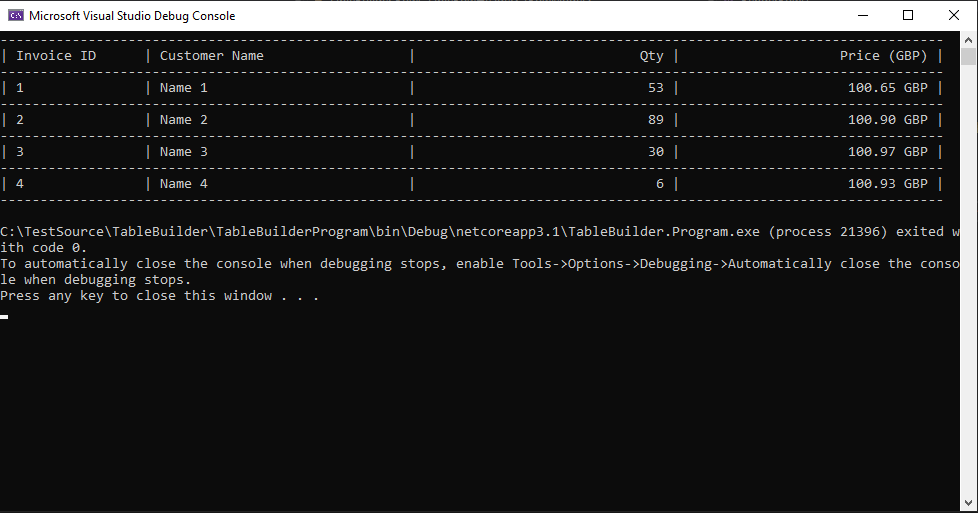

# TableBuilder
 A demo code to to build table with different type of columns
 This shows how multiple design patterns help to solve the issue:
 - Strategy Pattern: render different output with different types of column.
 - Bridge Pattern: decouple rendering cell task from the table to columns (so we can have same/different column implementation for different types of table).
 
 Requirement:
 - We need to build a table which allows us to bind any properties of an object. It automatically recognize the type of the property and format the displayed value accordingly.
 - The different types of property should have different displaying implementation and allow to be extended easily.
 - It should allow easily to extend more types of headers / footers.
 
 Output of the app display a table as below
 
